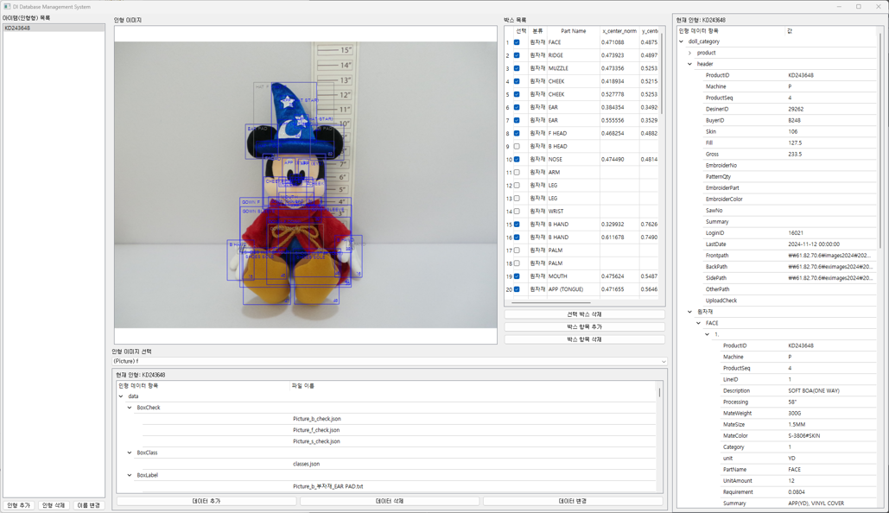
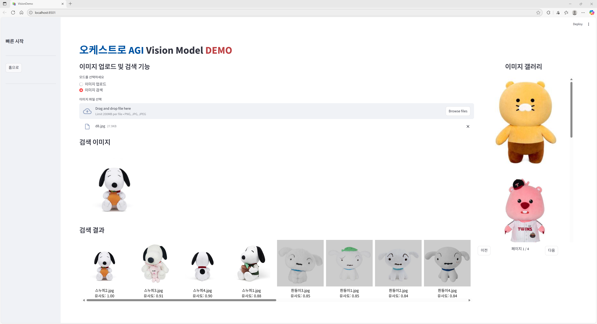

# Doll Image Search Service

> 인형 디자인 및 도안 제작 편의성을 위한 이미지 검색 시스템 개발
> 기간: 2024.03 – 2025.05 | Repo: github.com/fly4hyun/doll-image-search

---

## Summary

* 본 프로젝트는 **PoC/데모 단계**로, 인형 DB 구축 + 유사도 기반 검색 기능을 검증하기 위한 프로토타입 개발
* Dinov2 + FAISS 기반 검색 알고리즘 데모 구현 및 Streamlit UI로 서비스 형태 시연

---

## Features

* **인형 라벨링 툴 개발** — 카테고리/부품 구조화 및 검색 메타 구축
* **Dinov2 + FAISS** — 임베딩 기반 고속 이미지 검색 파이프라인 구현
* **Streamlit 데모 UI** — 검색 및 결과 시각화 데모 서비스 구성

---

## Image Assets

### 1) 라벨링 툴 화면

  

### 2) 인형 검색 데모 화면

  

---
